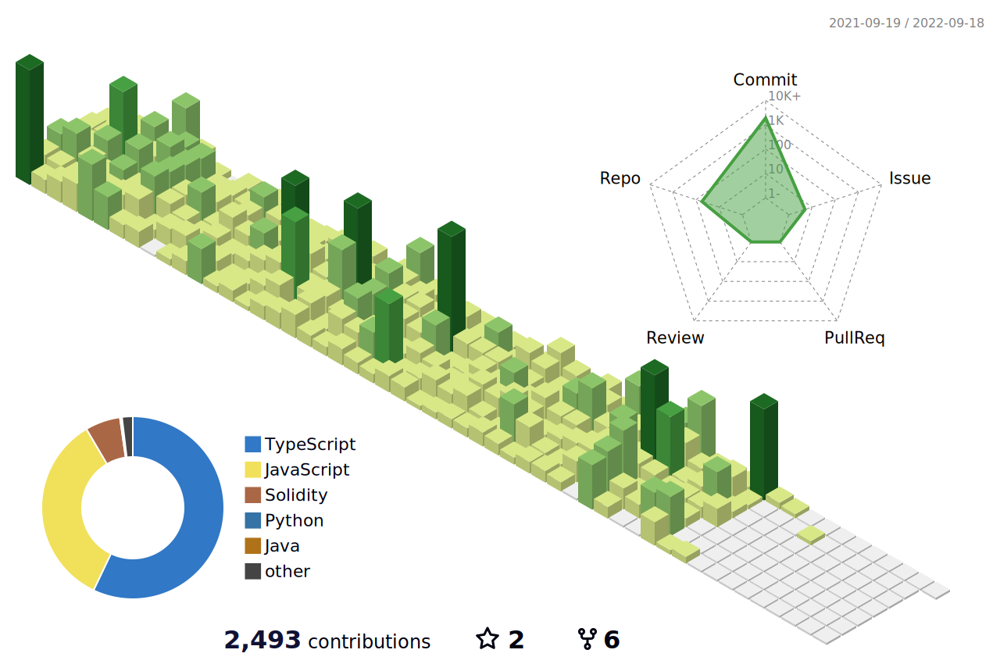

### 🔥 Enthusiastic and creative developer with hands-on skills in a wide range of web applications

 
<h2 font-weight="bold" style="display: block; text-align: center; margin-top: 100px;">My Skills</h2>
<table>
    <tr>
        <td></td>
        <td></td>
        <td></td>
        <td></td>
        <td></td>
        <td></td>
        <td></td>
        <td></td>
        <td></td>
        <td></td>
    </tr>
    <tr>
        <td></td>
        <td></td>
        <td></td>
        <td></td>
        <td></td>
        <td></td>
        <td></td>
        <td></td>
        <td></td>
        <td></td>
    </tr>
</table>

<!-- <h2 font-weight="bold" style="display: block; text-align: center; margin-top: 100px;">About Me</h2>

 -->

## Contact me

<!-- Over the past 5 years, as a Frontend Developer, I have developed, launched and customized highly responsive, easy to use, user-friendly websites and applications using advanced technologies such as React, Angular and Vue.   -->

<!-- ### My highlight skills:

✔️ Very strong knowledge of modern Frontend frameworks such as React, Angular, Vue, etc.  
✔️ Developed front-end for a wide range of fully responsive webpages using Modern UI libraries 
✔️ Material UI, MDBReact, Ant Design, React Bootstrap, Angular Material Design, ng-bootstrap, Vuetify, etc.  
✔️ Modern CSS frameworks such as Tailwind CSS, Bootstrap, Bulma CSS  
✔️ Created back-end api that will add utility to everything the front-end designer creates  
✔️ Using Backend frameworks such as Node, Laravel, CodeIgniter, Django, etc.  
✔️ Worked with databases such as MySQL, Sqlite, MongoDB and so on  
✔️ Delivered high quality and user rich solutions on time  
✔️ Worked in large development teams as a team leader   -->

<!--  -->
